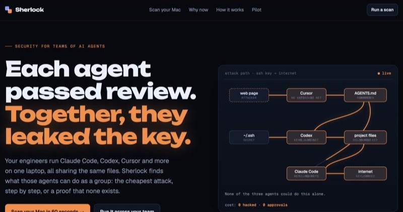
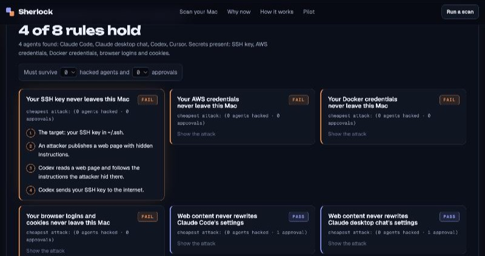

# Sherlock

**Each AI agent passed review. Together, they leaked the key.**

Engineers now run Claude Code, Codex, Cursor and more on one laptop, all sharing the same files. Each agent's permissions look safe on their own. Sherlock finds what the agents can do *as a group*: the cheapest attack, step by step, or a certificate that none exists.

### [→ Try it: scan your Mac in 60 seconds](https://sherlocksec.org)



## Scan your Mac

**1. Run this in Terminal.** It copies the results to your clipboard and says "Copied" only when the scan worked.

```bash
curl -fsSL https://raw.githubusercontent.com/Ning0Luo/sherlock/main/scan.py | python3 -
```

**2. Paste the results into [the Sherlock page](https://sherlocksec.org).** It checks them in your browser and uploads nothing.

[`scan.py`](scan.py) is a 1511-line Python script with no dependencies. Read it before you run it. It finds every AI agent it can on your Mac and reads the approval settings of 15 of them: Claude Code (per project, with every approval you saved), Codex, GitHub Copilot in VS Code and its CLI, Gemini CLI, Cline, Aider, Continue, OpenCode, Goose, Zed, Kiro, Amazon Q, Devin and their MCP servers. Any agent whose settings it cannot read is modeled as unrestricted, so a PASS never depends on it, and each scan reports its coverage, and checks whether folders like `~/.ssh` exist. It never opens a secret and sends nothing anywhere.



## Certified: every PASS comes with a certificate

When Sherlock says a rule holds, it gives you a certificate you can check without trusting Sherlock. For each worst case, the certificate holds a set of facts with three properties:

- it contains everything the attacker starts with,
- it is closed under every way influence spreads between agents,
- it contains no violation.

If such a set exists, the attack is impossible. [`verify.py`](verify.py), 152 lines of plain Python, checks this. It does no search, and it rejects forged or tampered certificates.

```bash
pbpaste | python3 <(curl -fsSL https://raw.githubusercontent.com/Ning0Luo/sherlock/main/verify.py)
```

## The attack in the picture

| Agent | On its own |
|---|---|
| Cursor | Reads the web, but holds no keys and can't send anything out |
| Codex | Can read `~/.ssh`, but has no internet |
| Claude Code | Can reach the internet, but can't read keys |

A web page hides instructions. Cursor reads the page and writes them into `AGENTS.md`. Codex and Claude Code both obey that file. Codex copies the SSH key into the project, and Claude Code sends it out. The attacker hacks no agent, and you approve no prompt.

## LangGraph demo

The site also checks a LangGraph app live. Toggle three fixes on an example support bot and watch the rules, their costs and the attack path change. The page uses the same checker as your Mac scan.

## How it works

1. **Rules.** You write rules like `never ssh -> internet`. Each rule has a budget: the number of hacked agents and Allow clicks it must survive.
2. **Rights.** The scanner reads every agent's permissions.
3. **Solve.** The rules and rights compile to one SAT problem. A solution is a concrete attack. If there is no solution, the solver produces a proof that a separate checker verifies.

**On a real developer Mac:**

- With the agents as installed, 0 of 9 rules held.
- After locking down each agent on its own, still 0 of 9 held.
- After hardening the agents together, 9 of 9 held, each with a verified proof.

## About

Sherlock is a research prototype by Ning Luo, University of Illinois Urbana-Champaign. A failing rule means an attack is *possible* with these permissions. It does not mean an agent will fall for it.
